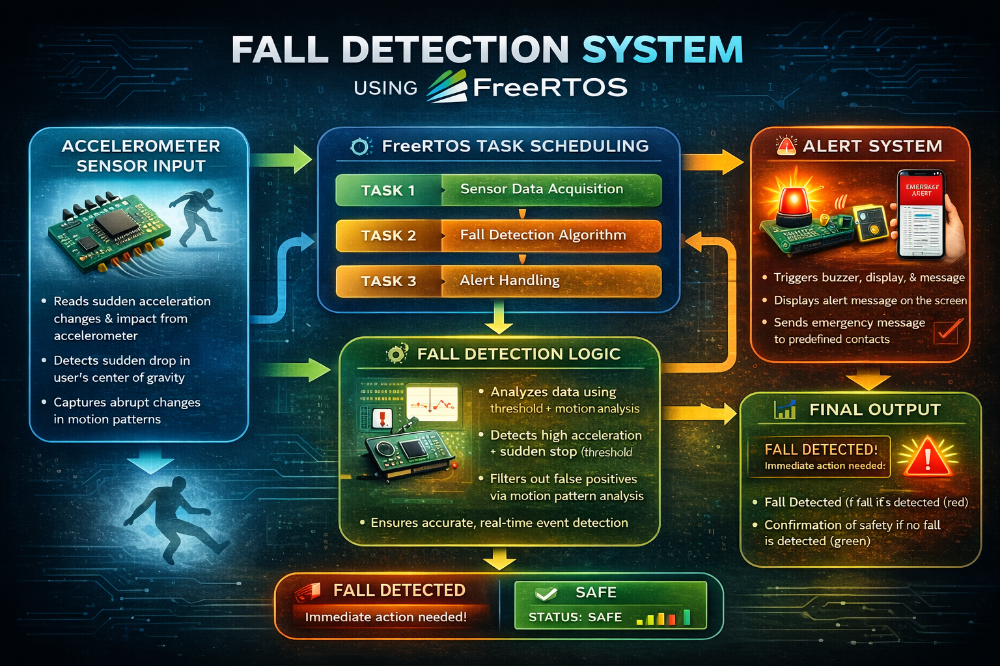

# 🧠 Fall Detection Simulator using FreeRTOS

  

  ⚙️ Real-Time Monitoring • FreeRTOS • Embedded Systems • Safety Application

---

## 📌 Overview

The **Fall Detection Simulator** is an embedded systems project developed using **FreeRTOS**, designed to detect sudden falls based on motion data and trigger alerts in real time.

The system simulates an accelerometer-based fall detection mechanism where motion data is continuously monitored and processed using **multi-task scheduling** in FreeRTOS. When abnormal motion patterns (such as sudden acceleration followed by inactivity) are detected, the system identifies it as a fall and activates an alert system.

Fall detection systems are widely used in healthcare and safety applications, especially for elderly individuals, as they enable quick response during emergencies :contentReference[oaicite:0]{index=0}.

---

## 🎯 Objective

- Implement real-time task scheduling using **FreeRTOS**
- Simulate accelerometer-based fall detection
- Design a multi-task embedded system
- Detect abnormal motion patterns
- Trigger alerts upon fall detection
- Understand real-time system behavior

---

## ⚙️ System Architecture

Accelerometer Input → FreeRTOS Tasks → Detection Logic → Alert System → Output

---

### 🔹 Components

- **Accelerometer Sensor (Simulated)**
  - Provides motion/acceleration data

- **FreeRTOS Scheduler**
  - Manages multiple concurrent tasks

- **Detection Algorithm**
  - Identifies fall patterns using thresholds

- **Alert System**
  - Generates buzzer/message alerts

- **Output Module**
  - Displays system status (Fall / Safe)

---

## 🔄 Working Principle

1. Sensor data (acceleration values) is generated or simulated  
2. FreeRTOS schedules multiple tasks:
   - Task 1: Sensor Data Acquisition  
   - Task 2: Fall Detection Processing  
   - Task 3: Alert Handling  
3. Detection logic analyzes:
   - Sudden acceleration spike  
   - Sudden inactivity  
4. If threshold conditions are met → Fall detected  
5. Alert system is triggered  
6. Final output is displayed  

---

## 🧠 Fall Detection Logic

The system uses **threshold-based motion analysis**:

- High acceleration (impact detection)
- Sudden drop or inactivity
- Change in motion pattern

This approach is commonly used in sensor-based fall detection systems to detect real-time events efficiently.

---

## ✨ Key Features

- ⚙️ FreeRTOS-based multi-tasking  
- 📊 Real-time data processing  
- 🧠 Threshold-based fall detection  
- 🚨 Instant alert system  
- 🔄 Efficient task scheduling  
- 💡 Embedded system simulation  

---

## 🛠️ Technologies Used

- **Programming Language:** C  
- **RTOS:** FreeRTOS  
- **Concepts:**
  - Real-Time Systems  
  - Task Scheduling  
  - Embedded Systems  
  - Sensor Data Processing  

---

## 📂 Project Structure

Fall_Detection_Simulator/
│
├── main.c # Entry point
├── tasks.c # FreeRTOS tasks implementation
├── sensor.c # Sensor data simulation
├── detection.c # Fall detection logic
├── alert.c # Alert system handling
├── FreeRTOSConfig.h # RTOS configuration
├── includes/ # Header files
└── README.md # Documentation

---

---

## ⚙️ FreeRTOS Task Design

| Task | Description |
|------|------------|
| Task 1 | Reads sensor data |
| Task 2 | Processes fall detection logic |
| Task 3 | Handles alert system |
| Task 4 | Updates output/display |

---

## 📊 Output

- **Fall Detected 🚨**  
- **Safe Status ✅**  

---

## 🔧 Skills

- C Programming  
- FreeRTOS  
- Embedded Systems  
- Real-Time Systems  
- Task Scheduling  
- Sensor Data Processing

---

## 💡 Applications

- Healthcare monitoring systems  
- Elderly safety devices  
- Wearable technology  
- Industrial worker safety  
- Smart home systems  

---

## ⚠️ Limitations

- Simulated sensor data (no real hardware)  
- Threshold-based detection (not AI-based)  
- Limited UI (CLI-based output)  

---

## 📌 Conclusion

This project demonstrates how **FreeRTOS** can be used to design real-time embedded systems for safety-critical applications like fall detection.

It provides hands-on experience in:

- Task scheduling  
- Real-time data processing  
- Embedded system design  
- Sensor-based event detection  

Such systems play a crucial role in improving safety and enabling faster emergency response in real-world scenarios.

---
